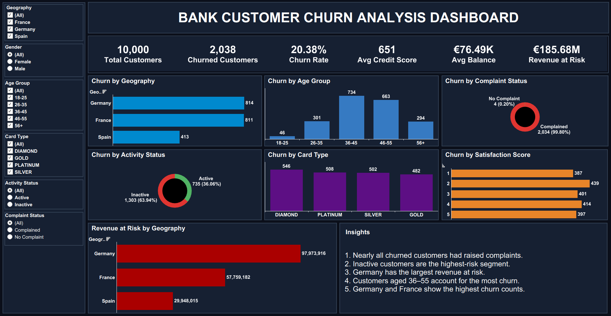

# Bank-Customer-Churn-Analysis-Excel-Tableau-Dashboard

## Description
This project analyses bank customer churn using MS Excel for data cleaning and preparation and Tableau for building an interactive dashboard. The dashboard identifies patterns in customer attrition across demographics, account activity, products, complaints, and satisfaction scores to help the bank reduce churn and retain valuable customers.

## Dashboard Preview

## Tools Used
- Microsoft Excel (Data Cleaning and Preparation)
- Tableau (Dashboard Creation)
- Calculated Fields
- Interactive Filters
- Dashboard Design

  ## Objectives
- Measure overall customer churn and revenue at risk
- Identify customer segments with the highest churn rates
- Analyze churn by geography, age group, and card type
- Evaluate the impact of complaints, activity status, and satisfaction on churn
- Provide actionable recommendations to improve customer retention

## Business Questions Addressed
1. What is the overall customer churn rate?
2. Which countries have the highest churn?
3. Which age groups are most likely to leave?
4. How does complaint status affect churn?
5. Do inactive members churn more than active members?
6. Which card types experience the highest churn?
7. How does satisfaction score influence churn?
8. How much revenue is at risk by geography?

## Key Insights
- The overall churn rate is approximately 20%.
- Germany has the highest churn rate(814) among all geographies.
- Customers aged 36-55 account for the most churn.
- Customers who raised complaints churn significantly more than those who did not.
- Inactive members are substantially more likely to leave than active members.
- Lower satisfaction scores are strongly associated with increased churn.
- Revenue at risk is highest in Germany due to elevated churn.

 ## Conclusion and Recommendations
The analysis reveals that churn is concentrated among older customers, inactive members, customers with complaints, and those with low satisfaction scores. To reduce attrition, the bank should proactively address complaints, engage inactive customers, and launch targeted retention campaigns for high-risk segments, especially in Germany.

## Files Included
- Bank_Customer_Churn_Dashboard.twb
- Bank_Customer_Churn_Data.xlsx
- dashboard.png
- README.md

## Download Project Files
- [Download Tableau Workbook](Bank_Customer_Churn_Dashboard.twb)
- [Download Cleaned Dataset](Bank_Customer_Churn_Data.xlsx)
